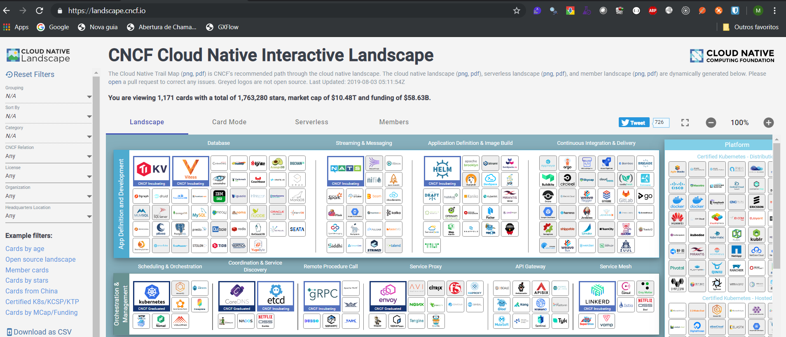

# Atividade 01

## Explorando o Cloud Native Interactive Landscape

Nesta primeira atividade vamos pesquisar no [CNCF Landscape](https://landscape.cncf.io/) alguns softwares para implementar o seguinte cenário:

- Aplicação Web ASP.NET Core
- Banco de Dados Relacional Open Source
- Cache de Dados
- Deploy Contínuo

Próxima: [Atividade 02](02-atividade.md)