# Atividade 05

## API Gateway

Nesta atividade vamos configurar um Api Gateway para uma api .NET Core. Usaremos o Kong API como Api Gateway.

- [Documentação do Kong](https://docs.konghq.com/)

O Kong por padrão não tem uma interface de administração, ele é configurado via APIs, mas para esta atividade, vamos utilizar uma aplicação chamada Konga para facilitar a configuração.

- [Konga](https://pantsel.github.io/konga/)

Dentro da pasta Handoncloud crie uma pasta chamada Atividade5.

Fazer o download do arquivo atividade5.zip, descompactar e copiar o arquivo docker-compose.yml e Dockerfile para a pasta Atividade5.

- [atividade5.zip](https://github.com/mshimao/Hands-On-Cloud-Native-com-Genexus/blob/master/docs/atividade/atividade5.zip)

Abra o arquivo docker-compose.yml, neste arquivo está sendo criado uma rede com o Kong API, o PostgreSQL, o Konga (UI para administração do Kong) e a API de soma.

```yaml
version: "3"

networks:
 kong-net:
  driver: bridge

services:

  #######################################
  # Postgres: The database used by Kong
  #######################################
  kong-database:
    image: postgres:9.6
    restart: always
    networks:
      - kong-net
    environment:
      POSTGRES_USER: kong
      POSTGRES_DB: kong
    ports:
      - "5432:5432"
    healthcheck:
      test: ["CMD", "pg_isready", "-U", "kong"]
      interval: 5s
      timeout: 5s
      retries: 5

  #######################################
  # Kong database migration
  #######################################
  kong-migration:
    image: kong:latest
    command: "kong migrations bootstrap"
    networks:
      - kong-net
    restart: on-failure
    environment:
      KONG_PG_HOST: kong-database
    links:
      - kong-database
    depends_on:
      - kong-database

  #######################################
  # Kong: The API Gateway
  #######################################
  kong:
    image: kong:latest
    restart: always
    networks:
      - kong-net
    environment:
      KONG_PG_HOST: kong-database
      KONG_PROXY_LISTEN: 0.0.0.0:8000
      KONG_PROXY_LISTEN_SSL: 0.0.0.0:8443
      KONG_ADMIN_LISTEN: 0.0.0.0:8001
    depends_on:
      - kong-migration
      - kong-database
    healthcheck:
      test: ["CMD", "curl", "-f", "http://kong:8001"]
      interval: 5s
      timeout: 2s
      retries: 15
    ports:
      - "8001:8001"
      - "8000:8000"

  #######################################
  # Konga database prepare
  #######################################
  konga-prepare:
    image: pantsel/konga:next
    command: "-c prepare -a postgres -u postgresql://kong@kong-database:5432/konga_db"
    networks:
      - kong-net
    restart: on-failure
    links:
      - kong-database
    depends_on:
      - kong-database

  #######################################
  # Konga: Kong GUI
  #######################################
  konga:
    image: pantsel/konga:next
    restart: always
    networks:
        - kong-net
    environment:
      DB_ADAPTER: postgres
      DB_HOST: kong-database
      DB_USER: kong
      TOKEN_SECRET: km1GUr4RkcQD7DewhJPNXrCuZwcKmqjb
      DB_DATABASE: konga_db
      NODE_ENV: production
    depends_on:
      - kong-database
    ports:
      - "1337:1337"

  #######################################
  # API GX: api soma
  #######################################

  apigx01:
    image: mkshimao/handsoncloudgx
    networks:
      - kong-net
```

Execute o comando `docker-compose up -d` para subir as imagens do docker.
```bat
C:\HandsOnCloud\Atividade5>docker-compose up -d
Creating network "atividade5_kong-net" with driver "bridge"
Creating atividade5_apigx01_1       ... done 
Creating atividade5_kong-database_1 ... done
Creating atividade5_konga_1          ... done
Creating atividade5_konga-prepare_1  ... done
Creating atividade5_kong-migration_1 ... done
Creating atividade5_kong_1           ... done 
```

Ao executar o comando `docker-compose ps` serão listados os contêineres criados.

```bat
C:\HandsOnCloud\Atividade5>docker-compose ps
           Name                          Command                State     Ports                                                                                         
-------------------------------------------------------------------------------                                                                                         
atividade5_apigx01_1          dotnet bin/GxNetCoreStartu ...   Exit 255                                                                                                 
atividade5_kong-database_1    docker-entrypoint.sh postgres    Exit 255                                                                                                 
atividade5_kong-migration_1   /docker-entrypoint.sh kong ...   Exit 0                                                                                                   
atividade5_kong_1             /docker-entrypoint.sh kong ...   Exit 255                                                                                                 
atividade5_konga-prepare_1    /app/start.sh -c prepare - ...   Exit 0                                                                                                   
atividade5_konga_1            /app/start.sh                    Exit 255                                                                          
```
Abra o browser e digite o endereço http://localhost:1337. Preencha os campos com as seguintes informações:
- Username: admin
- Email: admin@teste.com
- Password: adminagl

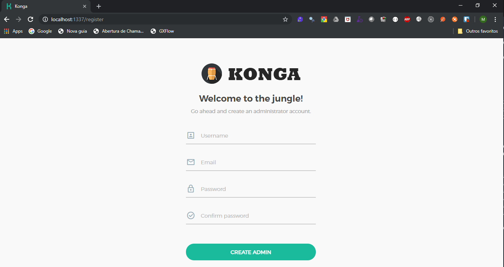

Para connectar a interface de Administração ao Kong, temos que configurar a conexão com a api de administração do Kong. Clique na opção CONNECTIONS do menu lateral e posteriomente no botão NEW CONNECTION.

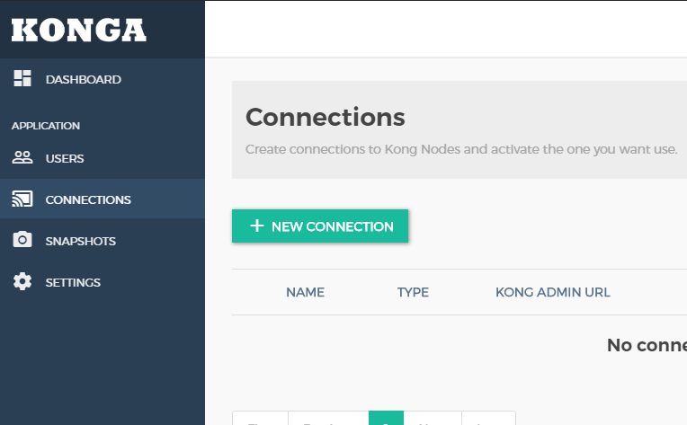

Preencha o nome com "Default" e a url com "http://kong:8001", clique em "CREATE CONNECTION".

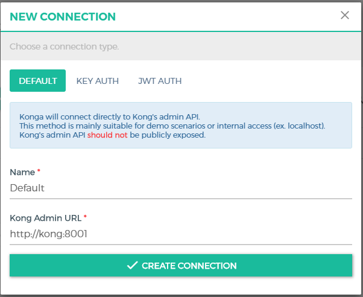

A conexão com o Kong deverá aparecer ativada.

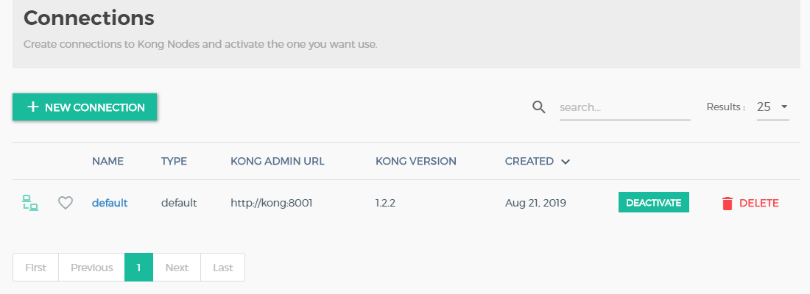

Agora vamos configurar a api de soma no Kong. Para isso clique na opção Services e depois no botão "ADD NEW SERVICE".

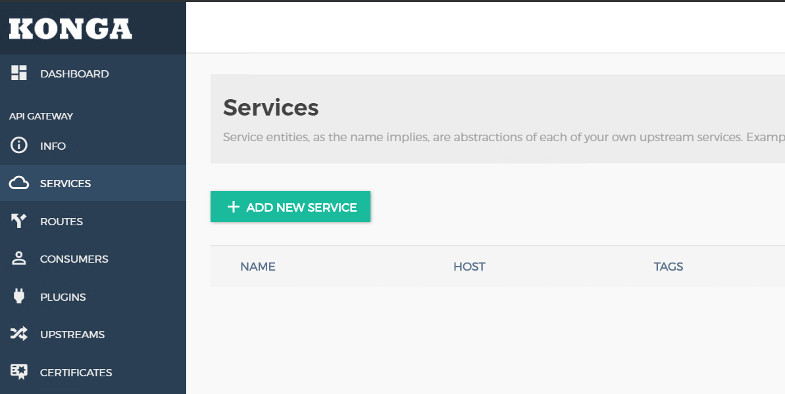

Informar os seguintes campos:
- Name: apigx
- Protocol: http
- Host: apigx01
- Port: 80
- Path: /
E clicar em "SUBMIT SERVICE".

Após a criação do serviço, clicar no item apigx na lista de serviços. E clicar na opção Routes e depois no botão "ADD ROUTE".

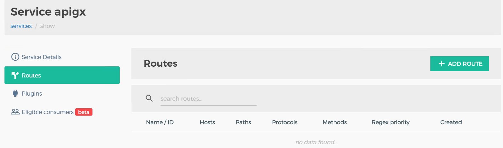

Informar o método POST no campo Methods, e clicar ENTER. Depois clicar em "SUBMIT ROUTE".


Com isso a API de Soma está configura no Kong, vamos testar usando o Postman, a url a ser acessada agora é http://localhost:8000/rest/soma pois é a porta publicada do Kong.

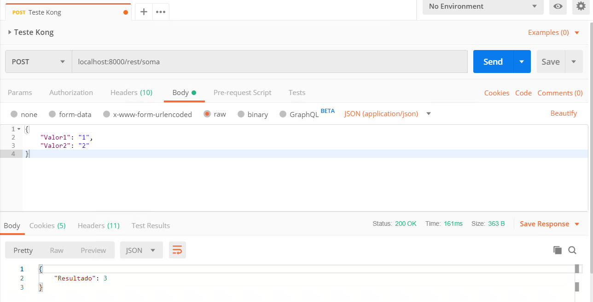

Uma das vantagens de utilizar um API Gateway é acrescentar funcionalidades sem ter que alterar a API original. Vamos configurar um autenticação na API de soma.
Para isso abra os detalhes do apigx, clique na opção Plugins e no botão "ADD PLUGIN".

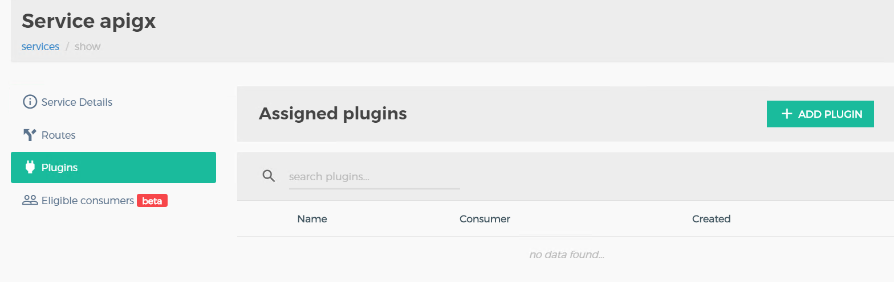

Selecionar o item KEY AUTH, no campo key names digite "apikey" e tecle ENTER. Confirmar clicando no botão "ADD PLUGIN"

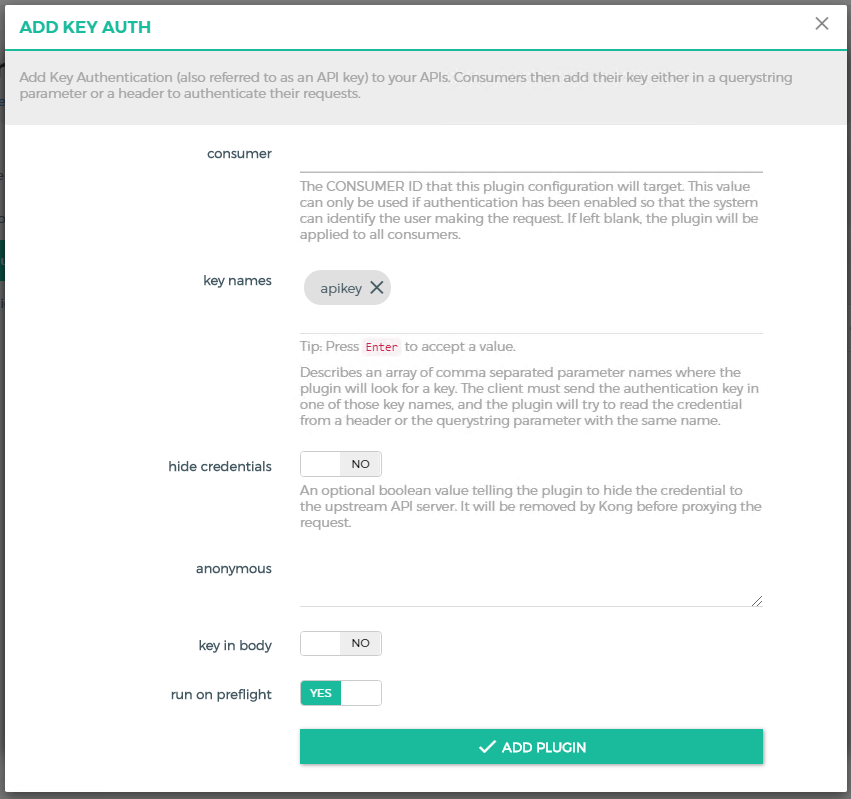

Agora a API de soma está protegida, execute novamente o teste no Postman e veja que é retornado um erro 401 Unauthorized.

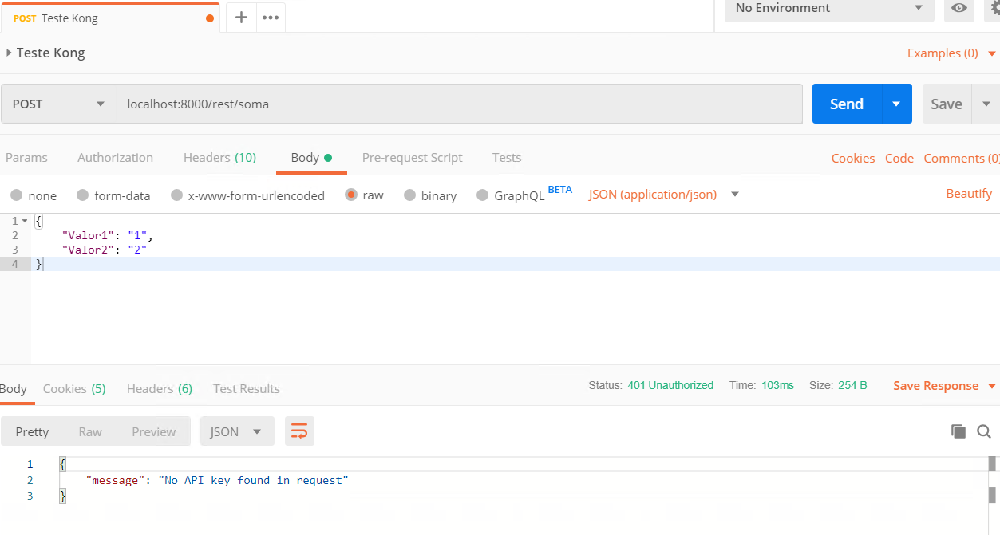

Vamos gerar um chave para que a api volte a funcionar. Para isso é necessário configurar um consumidor, clique na opção CONSUMERS e depois no botão "CREATE CONSUMER". No campo username digite "usuario" e clique em "SUBMIT CONSUMER".


O Consumer foi criado, agora é necessário criar um key, clique na opção "Credentials", depois em "API KEYS" e no botão "CREATE API KEY". No popup, é necessário apenas clicar em "SUBMIT".

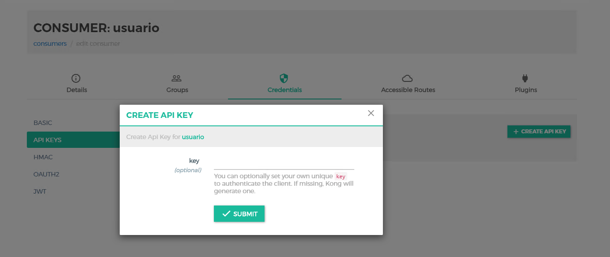

Execute novamente o teste no Postman, acrescentando no Headers a chave "apikey" e o valor gerado pelo Kong.

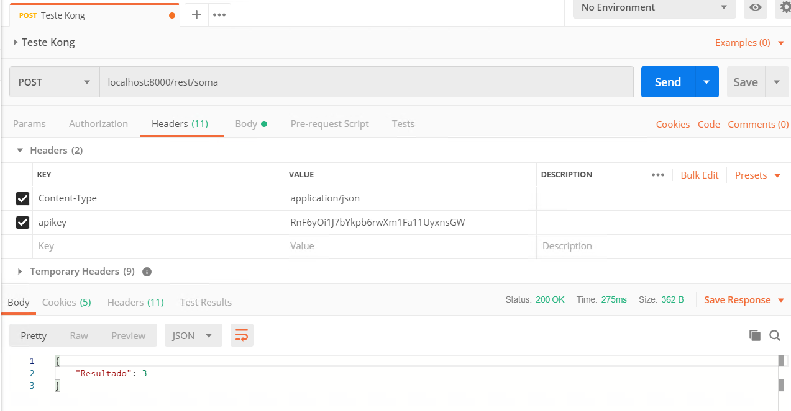

### Atividade Extra

Tente adicionar alguma api do site https://jsonplaceholder.typicode.com no Kong.


### Parar os contêineres

Execute o comando `docker-compose down` para parar o contêineres.

```bat
C:\HandsOnCloud\Atividade5
λ docker-compose down
Stopping atividade5_kong_1          ... done
Stopping atividade5_konga_1         ... done
Stopping atividade5_apigx01_1       ... done
Stopping atividade5_kong-database_1 ... done
Removing atividade5_kong_1           ... done
Removing atividade5_konga-prepare_1  ... done
Removing atividade5_kong-migration_1 ... done
Removing atividade5_konga_1          ... done
Removing atividade5_apigx01_1        ... done
Removing atividade5_kong-database_1  ... done
Removing network atividade5_kong-net

```


Próxima: [Atividade 05](05-atividade.md)