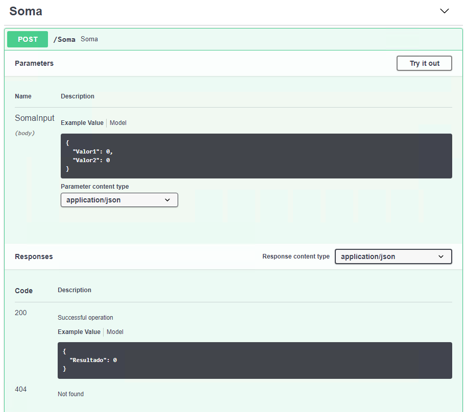
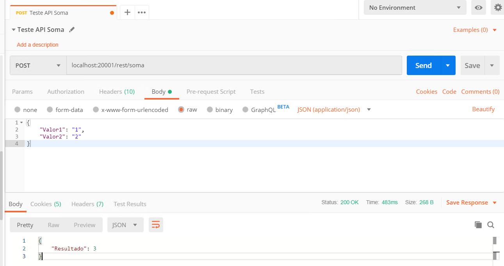
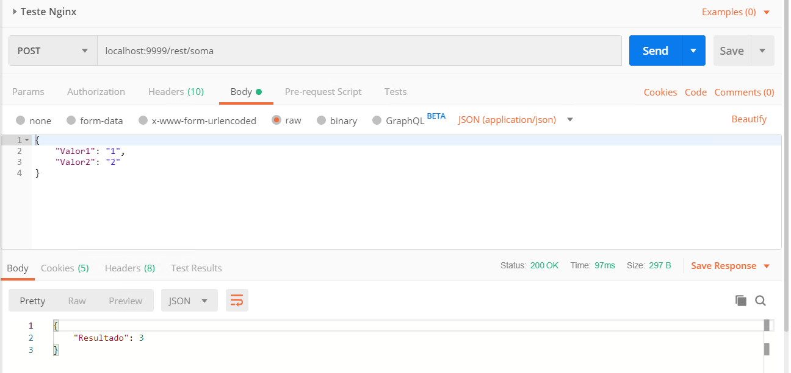

# Atividade 05

## API Gateway

Nesta atividade vamos configurar um Api Gateway para uma api .NET Core. Usaremos o Kong API como Api Gateway.

Dentro da pasta Handoncloud crie uma pasta chamada Atividade5.

Fazer o download do arquivo atividade4.zip, descompactar e copiar os arquivos docker-compose.yml e Dockerfile para a pasta Atividade4.

- [atividade4.zip](https://github.com/mshimao/Hands-On-Cloud-Native-com-Genexus/blob/master/docs/atividade/atividade4.zip)

Abra o arquivo docker-compose.yml, neste arquivo está sendo criado uma rede com dois nós, um rodando o Nginx e outro um serviço ASP.NET Core feito em Genexus.

```yaml
version: '3'

services:
  proxy:
    image: proxygx-nginx
    build:
      context: .
    ports:
      - "9999:80"
    depends_on:
      - apigx01
    networks:
      - proxygx-network
  
  apigx01:
    image: mkshimao/handsoncloudgx
    ports:
      - "20001:80"
    networks:
      - proxygx-network
  

networks: 
    proxygx-network:
      driver: bridge
```

O nó proxygx-nginx será gerado através do build do arquivo Dockerfile. A imagem usada é o nginx e durante o build o arquivo de configuração do Nginx é substituido.

```bash
FROM nginx
EXPOSE 80
RUN rm /etc/nginx/nginx.conf
COPY nginx.conf /etc/nginx/nginx.conf
```

Agora crie na pasta Atividade4 um arquivo chamado nginx.conf para configurar o Nginx com o seguinte conteúdo:

```yaml
events { worker_connections 1024; }

http {
     upstream apigx {
        server apigx01;
    }

    server {
        listen 80;
        location / {
            proxy_pass http://apigx;
        }
    }
}
```

Neste arquivo está sendo configurado o Nginx para encaminhar as requisições da porta 80 para o endereço apigx que está apontando para o servidor apigx01 que foi configurado no docker-compose. 

Execute o comando `docker-compose up -d` para subir as imagens do docker.
```bat
C:\HandsOnCloud\Atividade4
λ docker-compose up -d
Creating atividade4_apigx01_1 ... done
Creating atividade4_proxy_1   ... done
```

Ao executar o comando `docker network ls`, será listado a rede **atividade4_proxygx-network**.

```bat
C:\HandsOnCloud\Atividade4
λ  docker network ls
NETWORK ID          NAME                         DRIVER              SCOPE
82bc1989fe15        atividade4_proxygx-network   bridge              local
3cd62acdca03        bridge                       bridge              local
308f174ba3a3        host                         host                local
f03e2c44fa09        none                         null                local
```

Ao executar o comando `docker-compose ps` serão listados os contêineres criados.

```bash
C:\HandsOnCloud\Atividade4
λ docker-compose ps
       Name                     Command               State           Ports
-----------------------------------------------------------------------------------
atividade4_apigx_1   dotnet bin/GxNetCoreStartu ...   Up      0.0.0.0:20001->80/tcp
atividade4_proxy_1   nginx -g daemon off;             Up      0.0.0.0:20000->80/tcp
```

No nó apigx está publicado uma api rest feita em Genexus, que recebe 2 valores e devolve a soma.



Para efeitos de testes a api está acessível na porta 20001. Vamos usar o Postman para acessar a API, o endereço é http://localhost:20001/rest/soma.



Agora vamos testar se o Nginx está configurado corretamente, ele está exposto com a porta 9999, http://localhost:9999/rest/soma.



Execute o comando `docker-compose down` para parar o contêineres.

```bat
C:\HandsOnCloud\Atividade4
λ docker-compose down
Stopping atividade4_proxy_1   ... done
Stopping atividade4_apigx01_1 ... done
Removing atividade4_proxy_1   ... done
Removing atividade4_apigx01_1 ... done
Removing network atividade4_proxygx-network
```

Vamos agora esconder o nó que está executando a api e repetir os testes. Para isso, edite o arquivo docker-compose.yml, e remova a declaração da porta do nó apigx01     `ports: - "20001:80"`.

```yaml
  apigx01:
    image: mkshimao/handsoncloudgx
    networks:
      - proxygx-network
```

Execute novamente o comando `docker-compose up -d`, e repita os testes com o Postman. Agora o teste da api dará erro pois não está publicado, apenas o Nginx estará respondendo. Se executarmos o comando `docker-compose ps` veremos que apenas a imagem do nginx está com a porta configurada.

```bat
HandsOnCloud\Atividade4
λ docker-compose ps
O sistema não pode encontrar o caminho especificado.
        Name                      Command               State          Ports
------------------------------------------------------------------------------------
atividade4_apigx01_1   dotnet bin/GxNetCoreStartu ...   Up
atividade4_proxy_1     nginx -g daemon off;             Up      0.0.0.0:9999->80/tcp
```

Próxima: [Atividade 05](05-atividade.md)