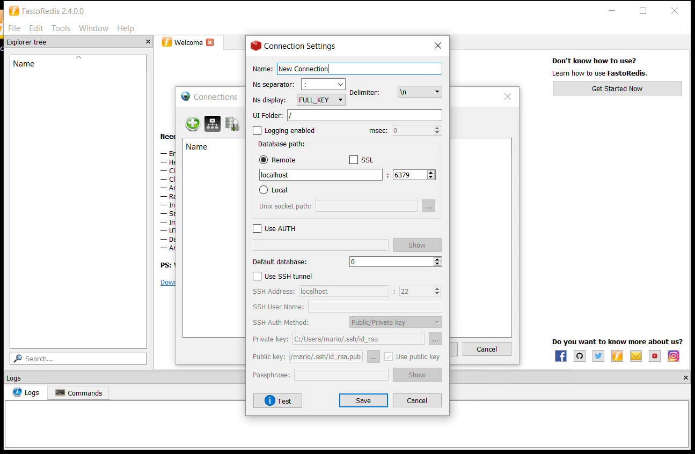
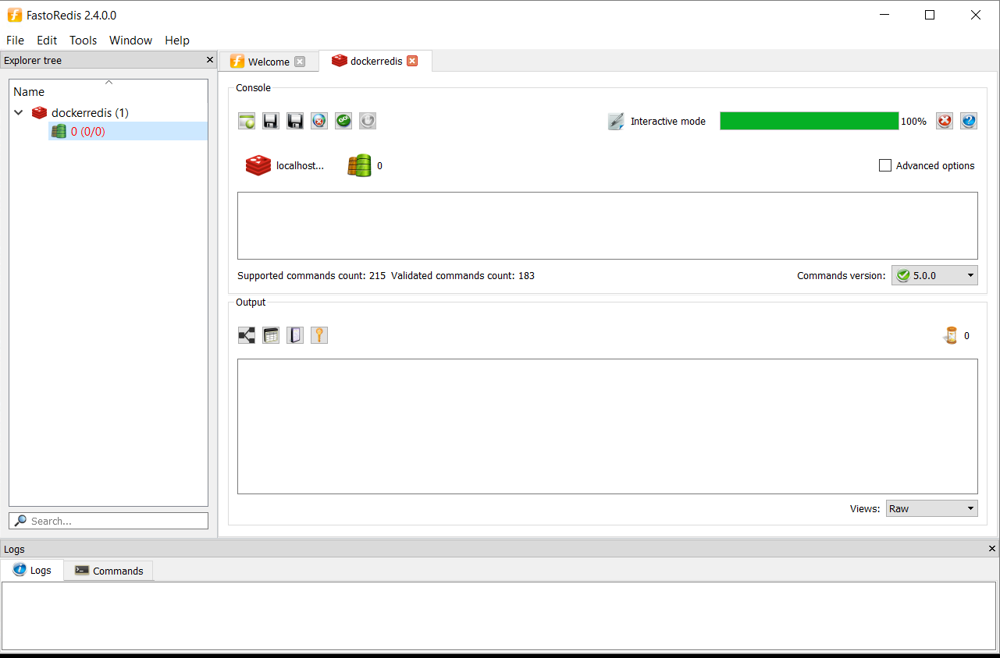

# Atividade 06

## Redis

Nesta atividade vamos configurar usar o Redis para fazer o cache de dados.

Para consultarmos os dados no Redis vamos usar um cliente free chamado FastoRedis, faça o download e a instalação do cliente.

- [Download FastoRedis](https://fastoredis.com/anonim_users_downloads)

Vamos usar o docker para executar o Redis, execute o comando `docker run --name redis13 -p 6379:6379 -d redis redis-server --appendonly no` para subir a imagem do Redis.

```bat
C:\HandsOnCloud\Atividade6
λ docker run --name redis13 -p 6379:6379 -d redis redis-server --appendonly no
Unable to find image 'redis:latest' locally
latest: Pulling from library/redis
1ab2bdfe9778: Already exists
966bc436cc8b: Pull complete
c1b01f4f76d9: Pull complete
8a9a85c968a2: Pull complete
8e4f9890211f: Pull complete
93e8c2071125: Pull complete
Digest: sha256:9755880356c4ced4ff7745bafe620f0b63dd17747caedba72504ef7bac882089
Status: Downloaded newer image for redis:latest
f6c0581497bc7e8eeec5b8ad5b87f054270097ad418d32fd42c6f928b61bbab0
```

Execute o FastoRedis, clique em "Add Connection", clique em Ok e configure a conexão para o locahost na porta 6379 com o nome **dockerredis**. 



Após a criação da conexão selecionar a conexão e clicar em Open.



Agora vamos criar uma API Rest em .NET que ao ser chamada verifica que se a informação está armazenada no Redis, caso não exista o cache, ele busca a informação de um personagem de Star Wars, e armazena no Redis.

A api que iremos acessar é a seguinte:

- https://swapi.co/api/people/{id}

O JSON retornado é a seguinte:

```json
{
    "name": "Luke Skywalker",
    "height": "172",
    "mass": "77",
    "hair_color": "blond",
    "skin_color": "fair",
    "eye_color": "blue",
    "birth_year": "19BBY",
    "gender": "male",
    "homeworld": "https://swapi.co/api/planets/1/",
    "films": [
        "https://swapi.co/api/films/2/",
        "https://swapi.co/api/films/6/",
        "https://swapi.co/api/films/3/",
        "https://swapi.co/api/films/1/",
        "https://swapi.co/api/films/7/"
    ],
    "species": [
        "https://swapi.co/api/species/1/"
    ],
    "vehicles": [
        "https://swapi.co/api/vehicles/14/",
        "https://swapi.co/api/vehicles/30/"
    ],
    "starships": [
        "https://swapi.co/api/starships/12/",
        "https://swapi.co/api/starships/22/"
    ],
    "created": "2014-12-09T13:50:51.644000Z",
    "edited": "2014-12-20T21:17:56.891000Z",
    "url": "https://swapi.co/api/people/1/"
}
```

- [Instruções para Genexus](06b-atividade.md)

- [Instruções para Visual Studio](06c-Atividade)