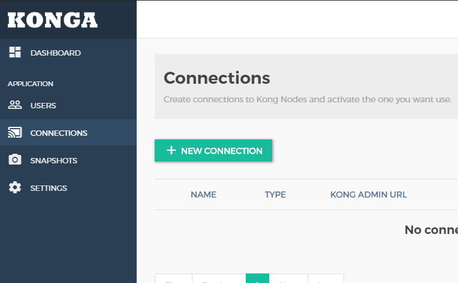
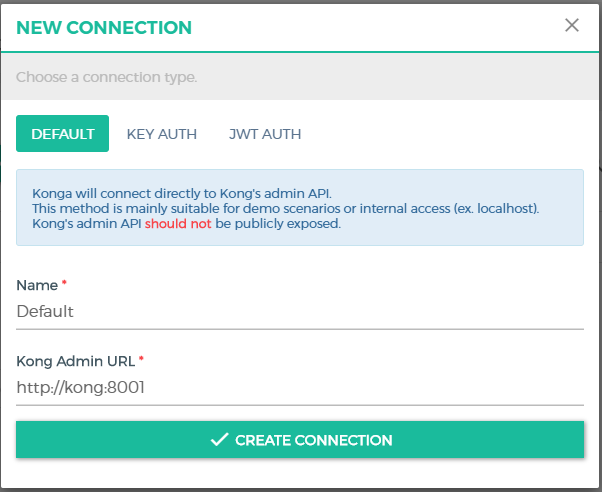
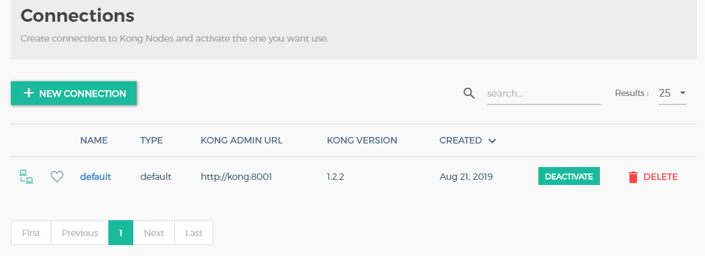

# Atividade 06

## Redis

Nesta atividade vamos configurar usar o Redis para fazer o cache de dados.

Para consultarmos os dados no Redis vamos usar um cliente free chamado FastoRedis, faça o download e a instalação do cliente.

- [Download FastoRedis](https://fastoredis.com/anonim_users_downloads)

Vamos usar o docker para executar o Redis, execute o comando `docker run --name redis13 -p 6379:6379 -d redis redis-server --appendonly no` para subir a imagem do Redis.

```bat
C:\HandsOnCloud\Atividade5
λ docker run --name redis13 -p 6379:6379 -d redis redis-server --appendonly no
Unable to find image 'redis:latest' locally
latest: Pulling from library/redis
1ab2bdfe9778: Already exists
966bc436cc8b: Pull complete
c1b01f4f76d9: Pull complete
8a9a85c968a2: Pull complete
8e4f9890211f: Pull complete
93e8c2071125: Pull complete
Digest: sha256:9755880356c4ced4ff7745bafe620f0b63dd17747caedba72504ef7bac882089
Status: Downloaded newer image for redis:latest
f6c0581497bc7e8eeec5b8ad5b87f054270097ad418d32fd42c6f928b61bbab0
```

Ao executar o comando `docker-compose ps` serão listados os contêineres criados.

```bat
C:\HandsOnCloud\Atividade5>docker-compose ps
           Name                          Command                State     Ports                                                                                         
-------------------------------------------------------------------------------                                                                                         
atividade5_apigx01_1          dotnet bin/GxNetCoreStartu ...   Exit 255                                                                                                 
atividade5_kong-database_1    docker-entrypoint.sh postgres    Exit 255                                                                                                 
atividade5_kong-migration_1   /docker-entrypoint.sh kong ...   Exit 0                                                                                                   
atividade5_kong_1             /docker-entrypoint.sh kong ...   Exit 255                                                                                                 
atividade5_konga-prepare_1    /app/start.sh -c prepare - ...   Exit 0                                                                                                   
atividade5_konga_1            /app/start.sh                    Exit 255                                                                          
```
Abra o browser e digite o endereço http://localhost:1337. Preencha os campos com as seguintes informações:
- Username: admin
- Email: admin@teste.com
- Password: adminagl


Para connectar a interface de Administração ao Kong, temos que configurar a conexão com a api de administração do Kong. Clique na opção CONNECTIONS do menu lateral e posteriomente no botão NEW CONNECTION.



Preencha o nome com "Default" e a url com "http://kong:8001", clique em "CREATE CONNECTION".



A conexão com o Kong deverá aparecer ativada.




Execute o comando `docker-compose down` para parar o contêineres.

```bat
C:\HandsOnCloud\Atividade4
λ docker-compose down
Stopping atividade4_proxy_1   ... done
Stopping atividade4_apigx01_1 ... done
Removing atividade4_proxy_1   ... done
Removing atividade4_apigx01_1 ... done
Removing network atividade4_proxygx-network
```


Próxima: [Atividade 05](05-atividade.md)