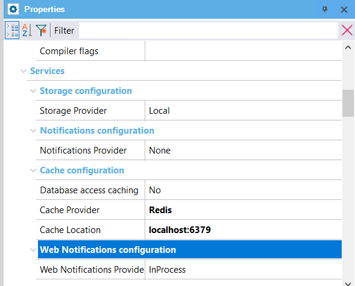
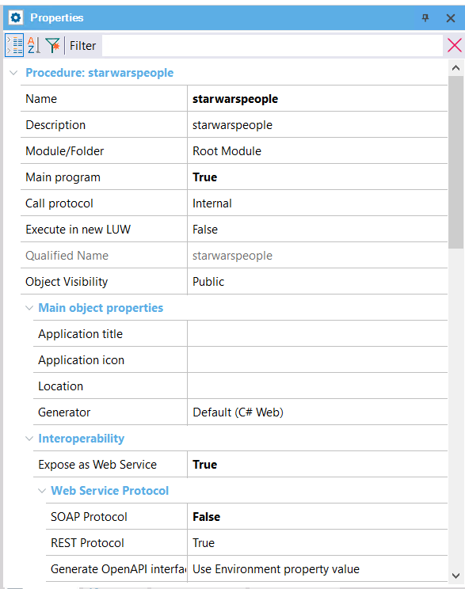

# Atividade 06

## Genexus e Redis

Criar uma Kb Genexus, usando o gerador .NET (não o Core, o Genexus não tem suporte a Redis no .NET Core no momento) e SQL Server.

Configure as propriedades Cache Provider e Cache Location, com o valores **Redis** e **localhost:6379**.

Crie uma procedure chamada **starwarspeople** como Main, com a propriedade Expose as Web Service com o valor **True** e a propriedade REST Protocol com o valor **True**.

Receba na proc um parâmetro Id que será passado para a chamada a API https://swapi.co/api/people/{id}. O retorno da proc será um STD com baseado no JSON retornado pela api.

Consulte as informações sobre o Cache API do Genexus para poder criar a procedure GX.

- [Cache API](https://wiki.genexus.com/commwiki/servlet/wiki?32105,Cache+API,)

Após terminar de desenvolver a proc, teste usando o Postman e o FastoRedis para verificar se os valores estão sendo gravados no Redis.

