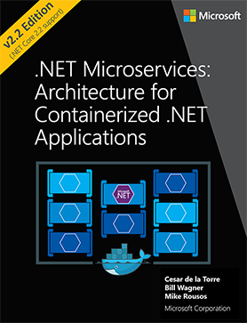

# Atividade 07

## Continuando a jornada

Seguem alguns recursos para entender melhor os conceitos que foram apresentados.

- [Youtube: Twelve Factor Apps in .NET : Building apps for the cloud - Ian Cooper](https://youtu.be/GzYkO6cJ1DA)

- [Video: Implement microservices patterns with .NET Core and Docker containers](https://channel9.msdn.com/events/Ignite/Microsoft-Ignite-Orlando-2017/BRK3317)

- [ebook: .NET Microservices: Architecture for Containerized .NET Applications](https://docs.microsoft.com/en-us/dotnet/architecture/microservices/index)

